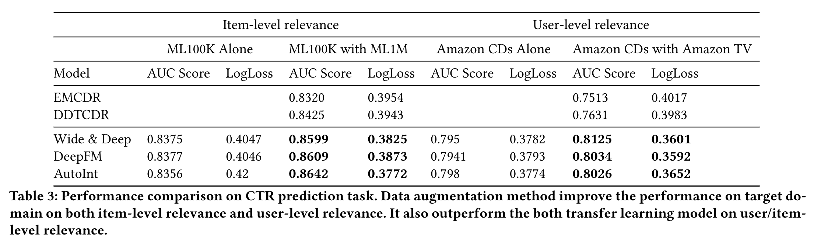

# Simple Transfer: Propogation Enhanced Cross-domain Data Augmentation for Recommender Systems

This repository is the official implementation of [Simple Transfer: Propogation Enhanced Cross-domain Data Augmentation for Recommender Systems](). 

<p align="center">

</p>

## Installation

To install requirements, download and install the Python 3.7 version of [Miniconda](https://docs.conda.io/en/latest/miniconda.html) or [Anaconda](https://www.anaconda.com/distribution/#download-section).

Then run the following commands to create a conda environment named `SimpleTransfer` with Python 3.7, and clone this repository into a folder named `SimpleTransfer` your machine.

```bash
git clone git@github.com:doubleblind193819461/SimpleTransfer.git
cd SimpleTransfer
conda create -n simple-transfer python=3.7
conda env update --name simple-transfer --file environment.yml
```

<!-- > 📋Describe how to set up the environment, e.g. pip/conda/docker commands, download datasets, etc... -->

## Training
## Quick start please check 
For a quick walkthrough on how to run `Simple Transfer Model`, take a look at the [demo.py](notebook/Demo.ipynb).
For train the model from scratch
```bash
cd scripts
python demo.py
```
<!-- 
```train
python train.py --input-data <path_to_data> --alpha 10 --beta 20
```

> 📋Describe how to train the models, with example commands on how to train the models in your paper, including the full training procedure and appropriate hyperparameters. -->


## Results
Our model achieves the following performance on different datasets comparing with different models:

<p align="center">

</p>

<p align="center">

</p>

<p align="center">

</p>

<!-- Our model achieves the following performance on :

### [Image Classification on ImageNet](https://paperswithcode.com/sota/image-classification-on-imagenet)

| Model name         | Top 1 Accuracy  | Top 5 Accuracy |
| ------------------ |---------------- | -------------- |
| My awesome model   |     85%         |      95%       |

> 📋Include a table of results from your paper, and link back to the leaderboard for clarity and context. If your main result is a figure, include that figure and link to the command or notebook to reproduce it. 
 -->
## Transfer learning model explore
we conduct experiment that we use the code and data of DDTCDR work on [github.com](https://github.com/lpworld/DDTCDR). Using the same train-test data split and evaluation protocol, comparing with the in-domain model SVD with only the target domain dataset. 

For a quick walkthrough on how to run `DDTCDR`, take a look at the [github.com](https://github.com/lpworld/DDTCDR). 
For demo notebook on SVD model, take a look at the [DDTCDR.ipynb](notebook/DDTCDR.ipynb)
For train the model and comparing with the SVD
```bash
cd DDTCDR
python train.py
```
## Results
SVD and DDTCDR model achive the following performance on movie and book datasets on MAE

| Model name         | Book data       | Movie data     |
| ------------------ |---------------- | -------------- |
| DDTCDR             |     0.17        |      0.161     |
| SVD                |     0.13        |      0.147     |

## Contributing

> 📋Pick a licence and describe how to contribute to your code repository. 